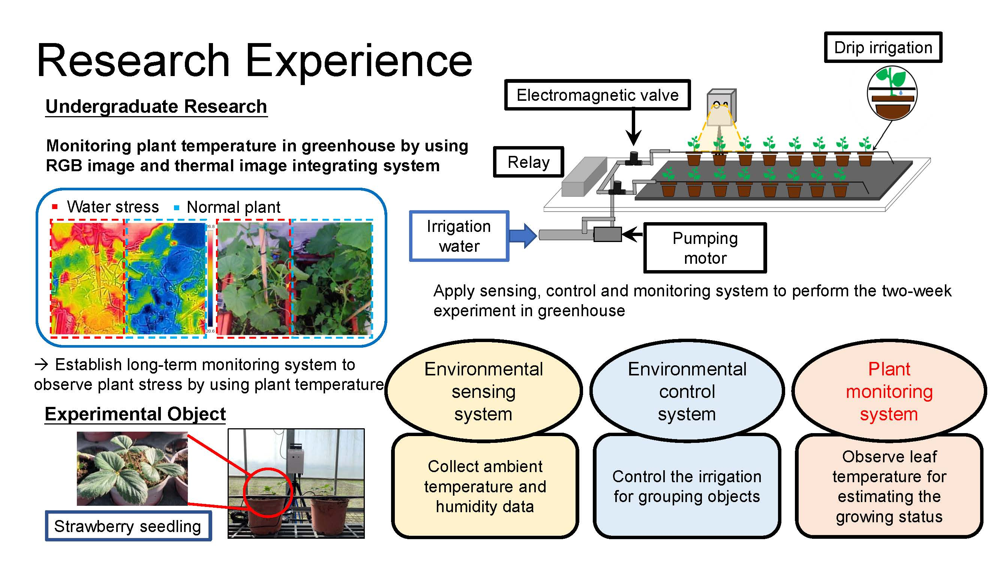
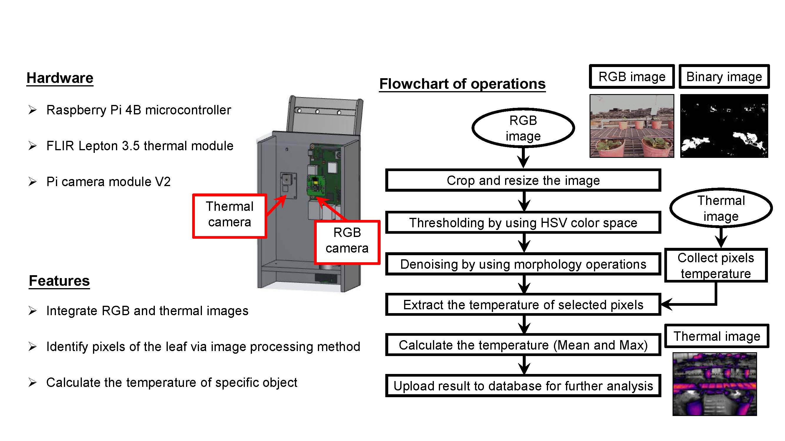
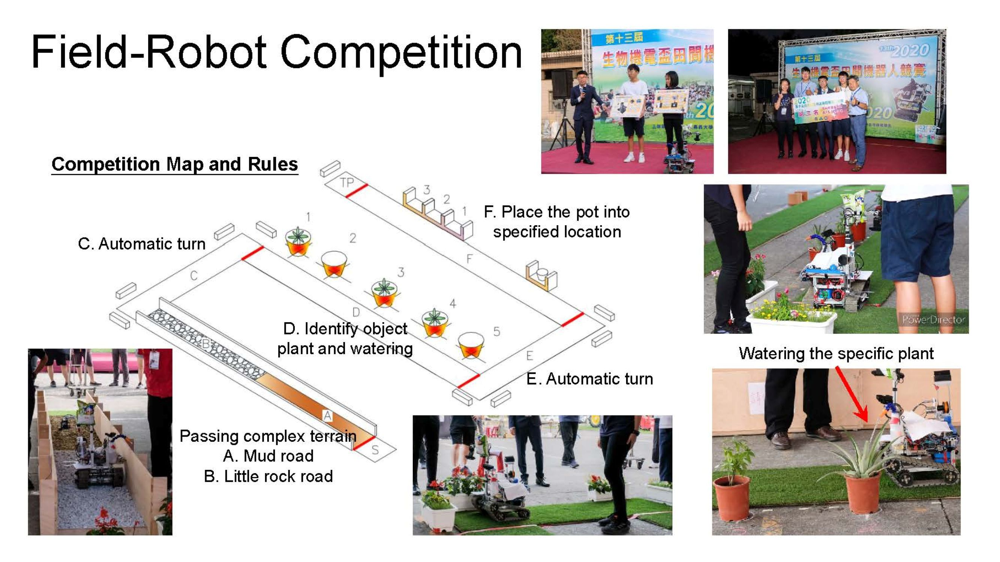
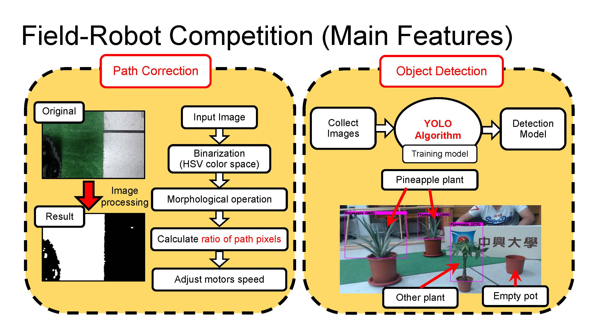

# About Me

## Education
- **Ph.D. in Electrical Engineering**, Pennsylvania State University (2022 - Present, GPA: 3.78)
- **B.S. in Bio-Industrial Mechatronics Engineering**, National Chung Hsing University (2017 - 2021, GPA: 4.13, Rank: 1/53)

## Key Experiences

### Teaching Assistant (Fall 2023 - Present)
- Led MATLAB and SIMULINK lab sessions for Linear Control Systems courses, helping students understand theoretical and practical aspects of control systems.
- Assisted professors in planning and executing lab experiments, ensuring smooth operation during sessions.

### Research Assistant (Spring 2020 - Fall 2022)
- **Wild Bird Tracking and Repelling System**:
  - Developed an AI-driven system using the YOLO algorithm to detect and repel birds with low-power lasers, reducing the risk of avian influenza.
- **Autonomous Plant Water-Stress Monitoring System**:
  - Designed and built an integrated system combining RGB and thermal cameras for real-time monitoring of plant health in greenhouses.

  

    
    
Experimental setup for plant health monitoring in a greenhouse

  

  

    
    
RGB and thermal image integration system for plant monitoring.

  

- Above projects are collaborated with industry partners (iChase and Hugreen) and funded by the Ministry of Science and Technology of Taiwan.

### Agricultural-Robot Competition (Spring 2019 - Fall 2020)
- Designed and implemented agricultural robots capable of irrigation, object detection, and terrain navigation.
- Achieved awards in national competitions for innovative designs and teamwork.

  

    
    
Robot demonstrating plant watering capabilities during the competition.

  

  

    
    
Main features for robot to complete the competition.

  

