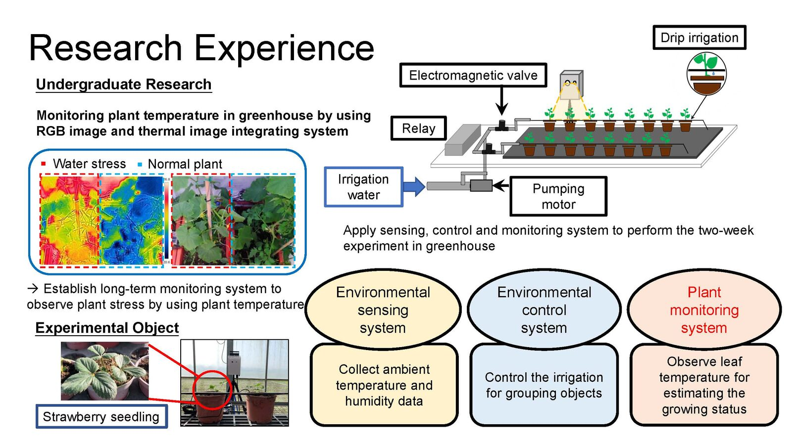
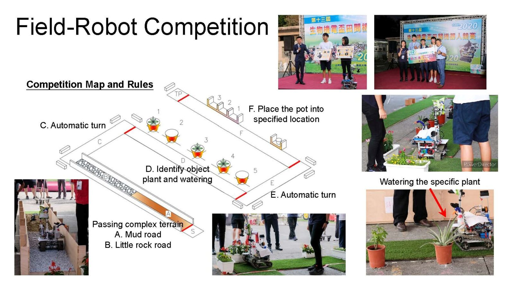

# About Me

<section class="intro">
  
  

    
I'm a Ph.D. candidate in Electrical Engineering at Penn State, advised by Prof. Donald Ebeigbe, working on learning-based robot locomotion, navigation, and state estimation. Below is a fuller account of my background and experience.

  

</section>

## Education

### The Pennsylvania State University (PSU) &mdash; Fall 2022 – Present
**Ph.D. Candidate in Electrical Engineering**. GPA 3.78/4.0.

Advisor: Prof. Donald Ebeigbe, [Control & Autonomous Robotics Lab](https://sites.psu.edu/carl/).

Research focus: learning-based robot locomotion, navigation, state estimation for robots.

### National Chung Hsing University (NCHU), Taiwan &mdash; Fall 2017 – Spring 2021
**B.S. in Bio-Industrial Mechatronics Engineering.** Junior/Senior GPA 4.13/4.3, Rank 1/53.

Advisor: Prof. Yao-Chuan Tsai, [Precision & Micro-Mechatronics Lab](https://pmmlnchu.wordpress.com/). 

## Experience

### Research Intern, [AlphaZ Robotics](https://alpha-z.ai/) &mdash; Summer 2025 – Present
- Built IsaacLab environments for RL-based obstacle avoidance and LiDAR-based navigation, and deployed trained local-planner policies on the Unitree Go1/Go2 for real-world experiments.
- Designed a Mamba-based temporal policy architecture for long-horizon navigation, contributing to an accepted IROS 2026 paper.

### Research Assistant, [Control & Autonomous Robotics Lab](https://sites.psu.edu/carl/), PSU &mdash; Fall 2025 – Present
- Developed torque-based reinforcement learning policies for energy-efficient quadruped locomotion in IsaacLab.
- Designed adversarial imitation learning pipelines to improve gait stability and robustness.

### Teaching Assistant, Linear Control Systems, PSU &mdash; Fall 2023 – Spring 2025
- Led MATLAB and Simulink laboratory sessions covering system modeling, feedback control, and system-stability analysis.

### Team Captain & Lead, Embedded Systems Team, PSU Mechnittany &mdash; Fall 2024 – Summer 2025
- Led the embedded systems team for RoboMaster, achieving a Top-5 placement at the 2025 competition.

### Research Intern, iChase Technology Co. &mdash; Spring 2022 – Summer 2022
Industry-academia collaboration with NCHU focused on biosecurity in poultry houses.
- **AI-Based Bird Tracking and Laser-Driven Repelling System** — Developed a YOLO-based tracking pipeline integrated with a laser deterrent for avian-influenza prevention.

### Research Assistant, [Precision & Micro-Mechatronics Lab](https://pmmlnchu.wordpress.com/), NCHU &mdash; Spring 2019 – Summer 2022
- Designed an autonomous greenhouse robot integrating RGB and thermal cameras for plant-health monitoring.
- Led a 4-member robotics team in the Agricultural Robotics Competition, achieving 2nd (2019) and 3rd (2020).

  <figure>
    
    <figcaption>Experimental setup for plant-health monitoring in a greenhouse.</figcaption>
  </figure>
  <figure>
    
    <figcaption>Agricultural-competition robot demonstrating plant watering.</figcaption>
  </figure>

## Awards & Honors

- Melvin P. Bloom Memorial Graduate Fellowship in Electrical Engineering, Penn State (2024)
- NCHU Golden Key Award — top-performing student in the class (2021)
- Third Place, Undergraduate Research Poster Competition, BIME Department (2021)

