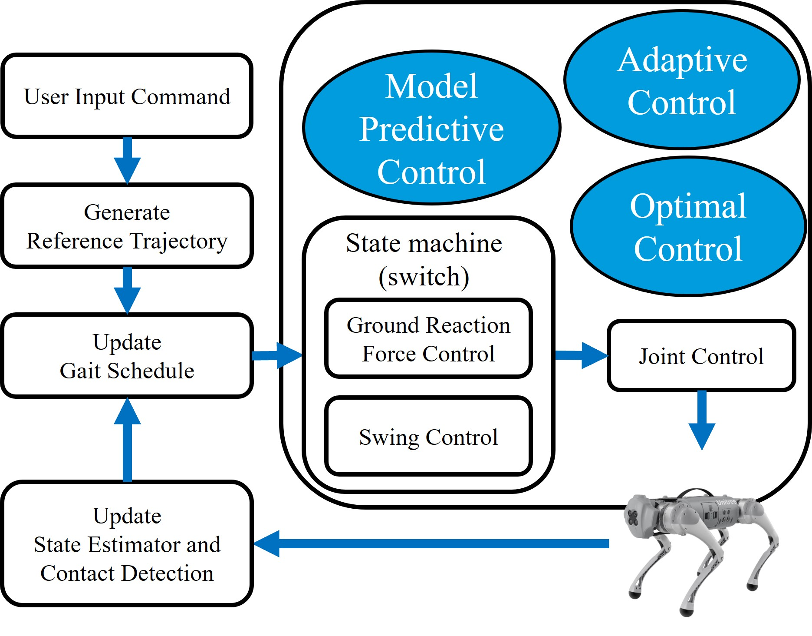
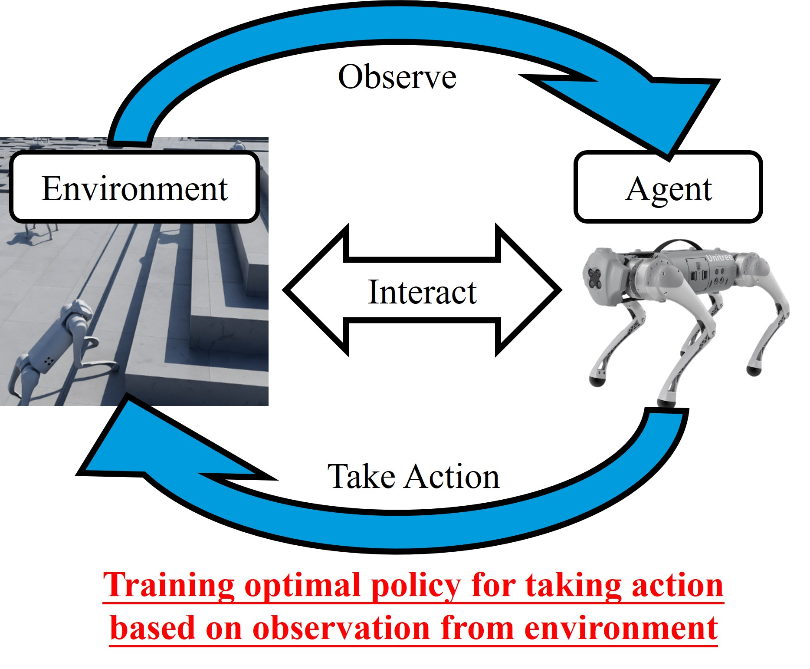

<section class="hero">
  

    <h1>Welcome to Hung-Chiehs Website</h1>
    
Hello, Im <strong>Hung-Chieh</strong>, a Ph.D. student specializing in <strong>Reinforcement Learning</strong> and <strong>Robotics</strong> at Penn State.

    
My research focuses on quadruped robots, applying advanced machine learning techniques to enhance robotic locomotion and adaptability.

  

</section>

  
  

<section class="container">
  

    <h2>Quick Summary of Me</h2>
    <a class="btn" href="assets/Hung_Chieh_CV.pdf">Check my CV!</a>
  

  <h3>Educations</h3>
  

  

    - Ph.D. in Electrical Engineering, The Pennsylvania State University, USA (2022 - Present, GPA: 3.78/4.0). 
    - B.S. in Bio-Industrial Mechatronics Engineering, National Chung Hsing University, Taiwan (2017 - 2021, GPA: 3.98/4.3, Rank: 1/53).
  

  

  <h3>Key Experiences</h3>
  

  

    - Teaching Assistant: Assisted students with MATLAB and Simulink on learning linear control systems. (2022 Fall - Present)  
    - Research Assistant: Developed computer vision-based systems for plant water-stress monitoring and AI-driven wild-bird repelling systems. 
    - Team Lead: Participated in National Agricultural Robotics Competitions in Taiwan. (2019 and 2020)
  

  

  <h3>Awards</h3>
  

  

    - Melvin P. Bloom Memorial Graduate Fellowship in Electrical Engineering (2024). 
    - NCHU Golden Key Award: Awarded to the top-performing student in the class (2021). 
    - Third place in Undergraduate Research Poster Competition, BIME Department (2021). 
    - Third place in National Agricultural Robotics Competition (2020). 
    - Second place in National Agricultural Robotics Competition (2019).
  

  

  <h3>Skills</h3>
  

  

    - Programming: Python, MATLAB, C++. 
    - Robotics Software: ROS, IsaacSim, IsaacLab.
  

  

</section>
