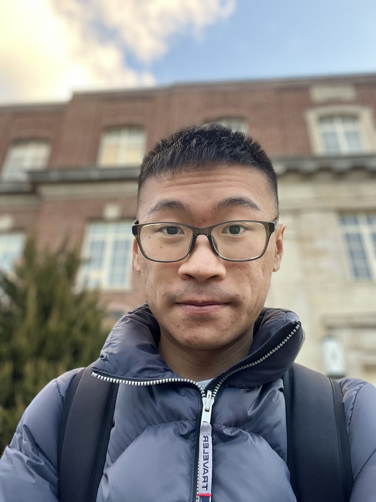
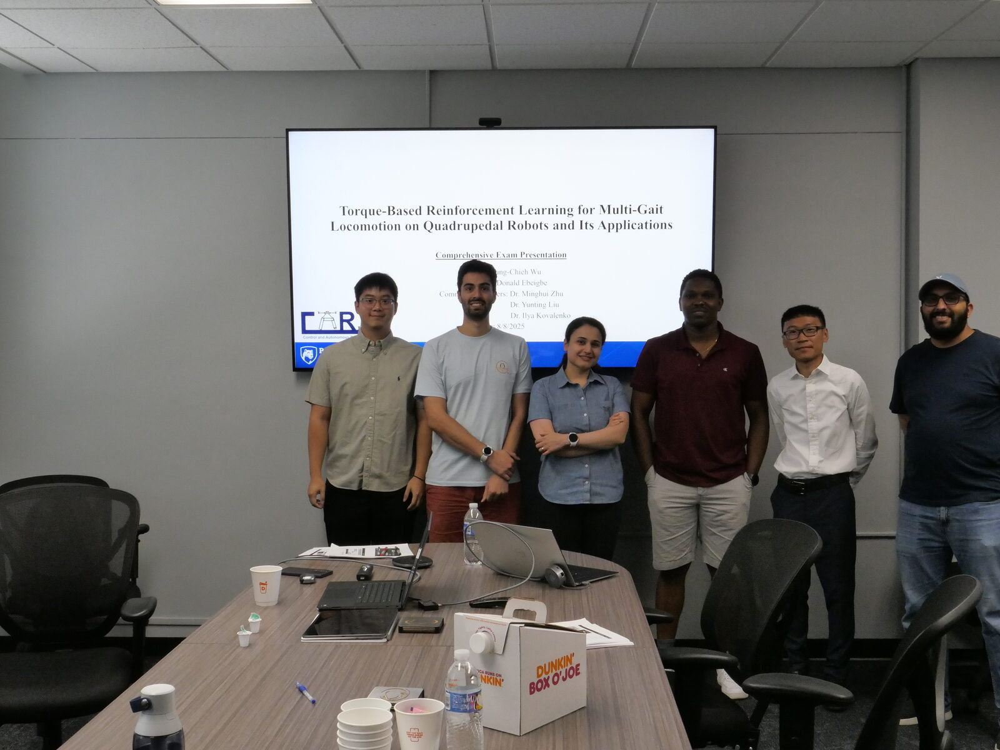
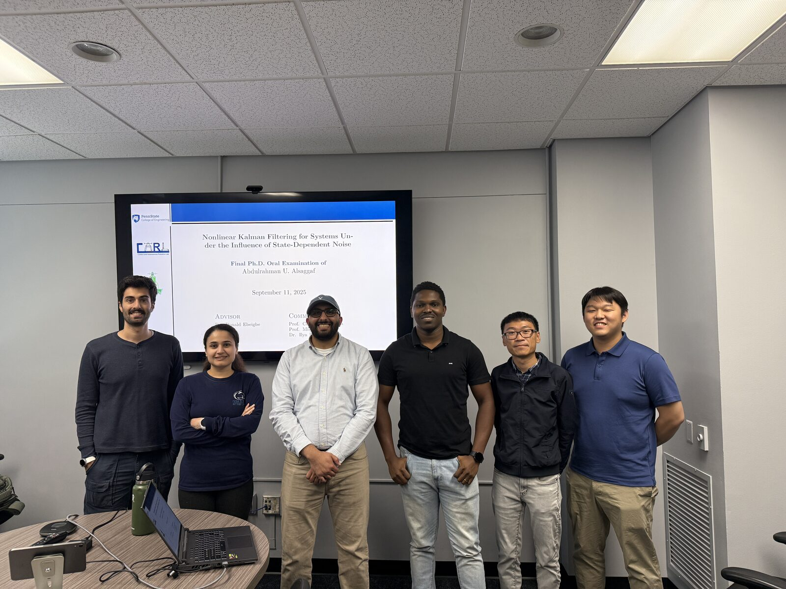
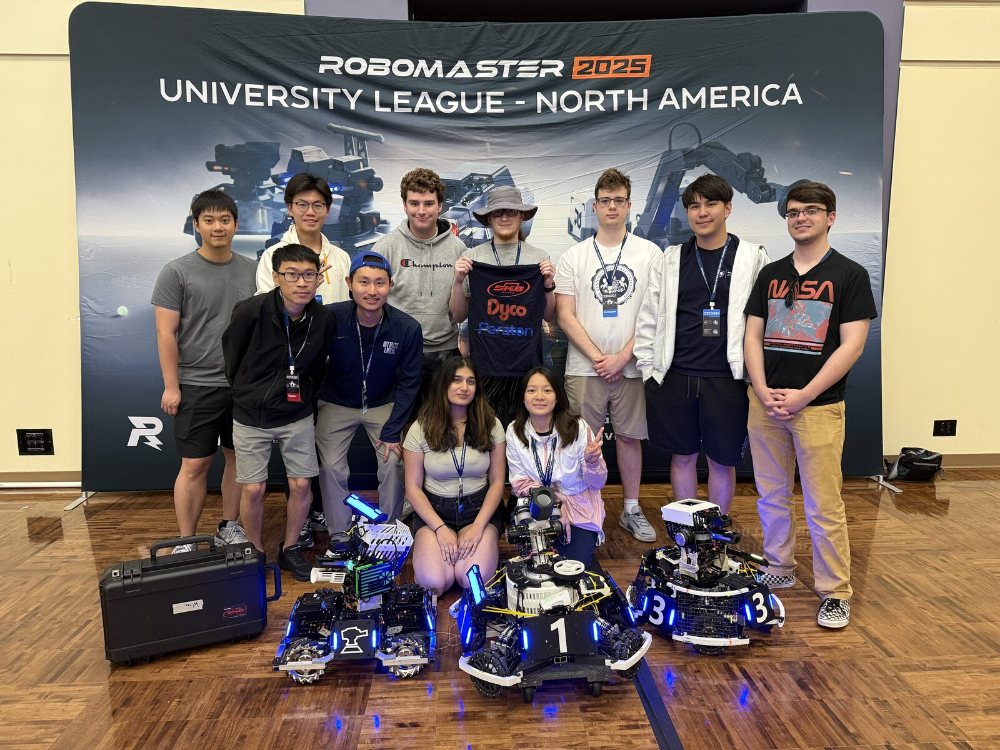
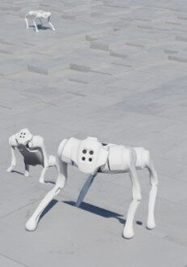
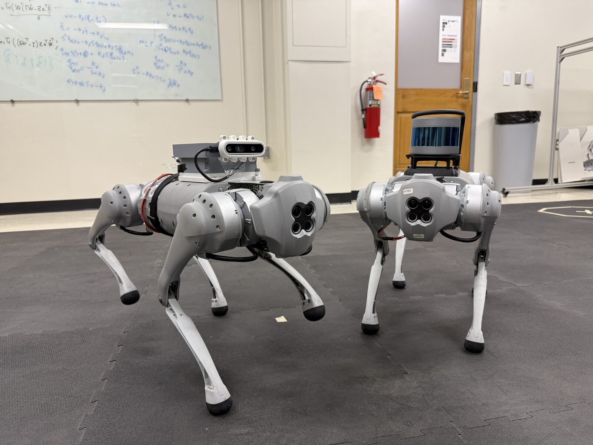
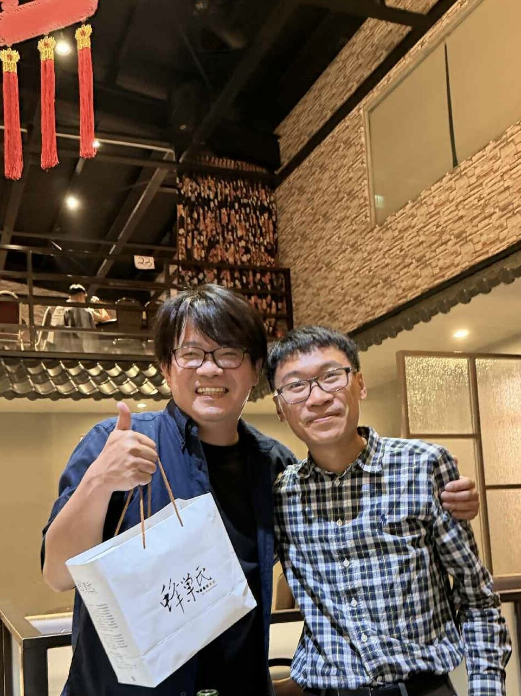
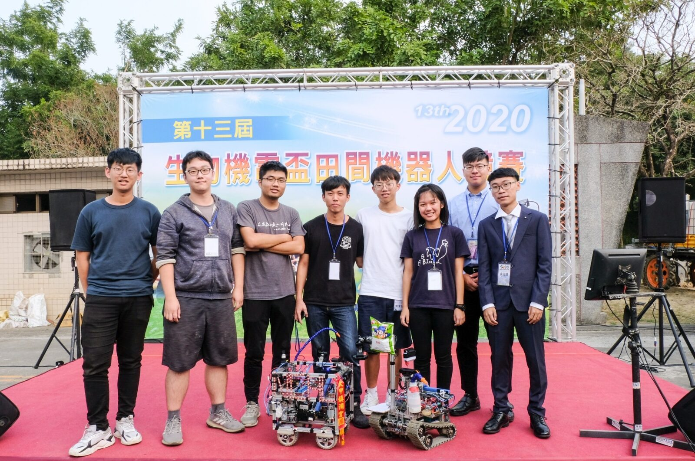

<section class="intro">
  
  

    <h1>Hung-Chieh Wu</h1>
    
Ph.D. Candidate in Electrical Engineering &middot; Penn State

    
I work on <strong>learning-based control and estimation for robotics</strong> — quadruped locomotion, navigation, state estimation, and now exploring world-model navigation. I currently work with Professor Donald Ebeigbe in the <a href="https://sites.psu.edu/carl/">Control &amp; Autonomous Robotics Lab</a> at Penn State. My goal is to make legged robots move and navigate robustly in the real world by combining state-of-the-art learning-based methods such as reinforcement learning and world models.

    

      <a href="mailto:hungchieh@psu.edu">Email</a>
      <a href="assets/docs/Hung_Chieh_CV.pdf">CV</a>
      <a href="https://github.com/hcwu7702">GitHub</a>
      <a href="https://www.linkedin.com/in/hung-chieh-wu">LinkedIn</a>
      <a href="https://scholar.google.com/citations?user=9_KSt2oAAAAJ&hl=en">Google Scholar</a>
      <a href="https://orcid.org/0009-0009-2140-4817">ORCID</a>
    

  

</section>

  

    <figure class="carousel__item">
      
      <figcaption>Pass Comprehensive Exam</figcaption>
    </figure>
    <figure class="carousel__item">
      
      <figcaption>Control &amp; Autonomous Robotics Lab</figcaption>
    </figure>
    <figure class="carousel__item">
      
      <figcaption>RoboMaster RoboX team (PSU Mechnittany)</figcaption>
    </figure>
    <figure class="carousel__item">
      
      <figcaption>Quadruped locomotion training in IsaacLab</figcaption>
    </figure>
    <figure class="carousel__item">
      
      <figcaption>Unitree quadruped robot</figcaption>
    </figure>
    <figure class="carousel__item">
      
      <figcaption>With my undergraduate advisor (Yao-Chuan Tsai)</figcaption>
    </figure>
    <figure class="carousel__item">
      
      <figcaption>Field Robot competition team in Taiwan</figcaption>
    </figure>
  

<h2>News</h2>

  <ul class="news">
    <li>2026 · Jun 16 <a href="stratmamba.html">StratMamba</a> paper accepted at <a href="https://2026.ieee-iros.org/">IEEE/RSJ IROS 2026</a>.</li>
    <li>2026 · Summer Joining <a href="https://alpha-z.ai/">AlphaZ Robotics</a> for a summer internship again!</li>
    <li>2025 · Aug 8 Passed the Comprehensive Exam and became a Penn State Ph.D. Candidate.</li>
  </ul>

<h2>Research Interests</h2>

- **Legged locomotion** — torque-based reinforcement learning with adversarial imitation (AMP) for energy-efficient, robust quadruped gaits.
- **Robot navigation** — temporal, Mamba-based policies and learned local planners for long-horizon, LiDAR-based navigation in cluttered environments.
- **State estimation** — a Kalman-filter-inspired prediction–correction network for more accurate and reliable robot state estimation.

  <h2>Education</h2>
  <a class="btn" href="assets/docs/Hung_Chieh_CV.pdf">Download CV</a>

- **Ph.D. Candidate, Electrical Engineering** — The Pennsylvania State University (Fall 2022 – Present, expected May 2027). Advisor: Prof. Donald Ebeigbe.
- **B.S. in Bio-Industrial Mechatronics Engineering** — National Chung Hsing University, Taiwan (Fall 2017 – Spring 2021). Advisor: Prof. Yao-Chuan Tsai.

<h2>Selected Experience</h2>

- **Research Intern, [AlphaZ Robotics](https://alpha-z.ai/)** (Summer 2025 – Present) — Mamba-based temporal policy for robot navigation, contributing to an accepted IROS 2026 paper.
- **Research Assistant, [Control & Autonomous Robotics Lab](https://sites.psu.edu/carl/), PSU** (Fall 2025 – Present) — Torque-based RL for energy-efficient quadruped locomotion and adversarial imitation learning for sim-to-real transfer.
- **Team Captain, Embedded Systems (RoboMaster), PSU Mechnittany** (Fall 2024 – Summer 2025) — Led the embedded team to a Top-5 finish at the 2025 international competition.
- **Teaching Assistant, Linear Control Systems, PSU** (Fall 2023 – Spring 2025) — Led MATLAB/Simulink labs on state-space modeling, feedback control, and stability analysis.

<a href="about.html">See full experience &rarr;</a>

<h2>Selected Publications</h2>

- **H.-C. Wu** and the AlphaZ Robotics Team, *"StratMamba: Strategic and Reactive Stream Partitioning for Path-Efficient LiDAR-Based Obstacle Avoidance,"* IEEE/RSJ IROS, 2026 (Accepted).
- K. Sinaei, **H.-C. Wu**, and D. Ebeigbe, *"Safety-Critical Position Control of Robots: A Model-Free Approach,"* American Control Conference (ACC), 2025.

<a href="publications.html">All publications &rarr;</a>

<h2>Awards &amp; Honors</h2>

- Melvin P. Bloom Memorial Graduate Fellowship in Electrical Engineering, Penn State (2024)
- NCHU Golden Key Award — top-performing student in the class (2021)
- Third Place, Undergraduate Research Poster Competition, BIME Department (2021)

