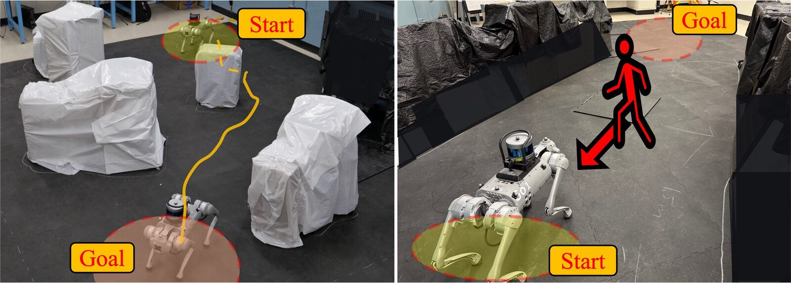

# Projects

  <a class="project-card" href="stratmamba.html">
    
    

      <h3>StratMamba</h3>
      
IEEE/RSJ IROS 2026 &middot; Accepted

      
A dual-stream Mamba architecture that partitions reactive obstacle avoidance and strategic goal-directed planning for path-efficient LiDAR navigation, validated on a real Unitree GO1.

    

  </a>

