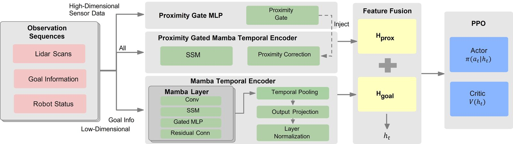
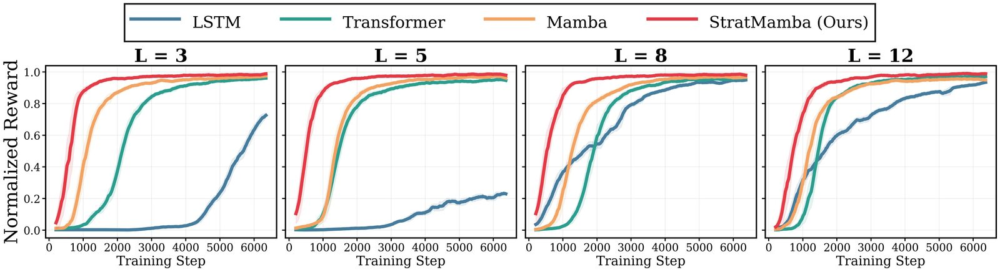

  <h1>StratMamba: Strategic and Reactive Stream Partitioning for Path-Efficient LiDAR-Based Obstacle Avoidance</h1>
  

    <strong>Hung-Chieh Wu</strong>1,2, Xiaopan Zhang2,3, Kasra Sinaei1,2, Ryan Abnavi2,
    Kasun Weerakoon2, Christopher Bradley2,4, Seyed Fakoorian2, Jiachen Li3, Donald Ebeigbe1
  

  
1The Pennsylvania State University &nbsp;&middot;&nbsp; 2<a href="https://alpha-z.ai/">AlphaZ Robotics</a> &nbsp;&middot;&nbsp; 3Georgia Institute of Technology &nbsp;&middot;&nbsp; 4Massachusetts Institute of Technology (CSAIL)

  
Accepted at IEEE/RSJ IROS 2026.  
  
  
The camera-ready paper will be made publicly available after publication   
 

  

    <a href="#" class="link--pending" title="The paper is not yet publicly available">Paper (Coming Soon)</a>
  

  <iframe src="https://www.youtube-nocookie.com/embed/Z0FfO_AVaSw?rel=0"
          title="StratMamba demo"
          loading="lazy"
          allow="accelerometer; autoplay; clipboard-write; encrypted-media; gyroscope; picture-in-picture; web-share"
          allowfullscreen></iframe>

## Abstract

This paper proposes **StratMamba**, a dual-stream Mamba-based temporal modeling architecture that more efficiently captures the long-horizon temporal dependencies required for robot navigation in complex and obstacle-rich environments. StratMamba combines fast-decay and slow-decay memory streams: the **fast-decay (proximity) stream** processes high-frequency LiDAR data for *reactive* obstacle avoidance, while the **slow-decay (goal) stream** maintains longer-horizon goal information for *strategic* planning. We evaluate diverse obstacle-avoidance scenarios in IsaacLab and Gazebo, and validate successful sim-to-real deployment on a Unitree GO1 quadruped navigating around static and dynamic obstacles. Against temporal RL baselines (LSTM, Transformer, and Vanilla-Mamba), StratMamba achieves exceptional temporal-reasoning efficiency with a lower timeout rate while maintaining the fastest navigation speed (576 median steps, 5.0% better than Vanilla-Mamba) and the highest path optimality (0.915 path efficiency). In the real world, StratMamba remains robust across extended LiDAR ranges, demonstrating that dual-stream partitioning effectively balances reactive safety with strategic navigation under challenging sensing conditions.

<figure>
  
  <figcaption>Overview of StratMamba: observation sequences are partitioned into a proximity stream for reactive obstacle avoidance and a goal stream for strategic navigation, fused and fed to a PPO actor-critic.</figcaption>
</figure>

## Key Contributions

- **Dual-rate state partitioning.** A Mamba-based RL policy that separates *reactive* obstacle avoidance from *strategic*, goal-directed planning via complementary streams with disjoint input routing.
- **Faster, more stable training.** Converges up to **1.5× faster** than LSTM and Transformer across all sequence lengths, while retaining Mamba's linear *O(L)* complexity.
- **State-of-the-art navigation.** Lowest timeout rate (**0.4%** vs. 34.0% for LSTM), up to 13.4% higher path efficiency, and the smoothest trajectories (best SPARC and LDLJ).
- **Robust sim-to-real transfer.** Generalizes from IsaacLab (Unitree GO2) to Gazebo (Clearpath Husky) to a real Unitree GO1 — and stays reliable at extended LiDAR ranges where Vanilla-Mamba and Transformer fail catastrophically.

## Results at a Glance

| Method | Timeout ↓ | Median steps ↓ | Path efficiency ↑ | SPARC ↑ |
|---|---|---|---|---|
| LSTM | 34.0% | 684 | 0.807 | −3.624 |
| Transformer | 1.1% | 621 | 0.851 | −3.594 |
| Vanilla-Mamba | 0.8% | 606 | 0.865 | −3.578 |
| **StratMamba (ours)** | **0.4%** | **576** | **0.915** | **−3.550** |

*Averaged over sequence lengths L ∈ {3, 5, 8, 12} in IsaacLab. In real-world GO1 trials, StratMamba reaches the best success rate and SPL across both 1.5 m and 3.0 m LiDAR ranges.*

<figure>
  
  <figcaption>Normalized training reward across sequence lengths L ∈ {3, 5, 8, 12}. StratMamba consistently converges fastest and reaches near-optimal performance across horizons.</figcaption>
</figure>

## Citation

*Accepted at IROS 2026 — the paper is not yet publicly available. Full citation details (pages, DOI) will be updated upon publication.*

<pre class="bibtex"><code>@inproceedings{wu2026stratmamba,
  title     = {StratMamba: Strategic and Reactive Stream Partitioning for Path-Efficient LiDAR-Based Obstacle Avoidance},
  author    = {Wu, Hung-Chieh and Zhang, Xiaopan and Sinaei, Kasra and Abnavi, Ryan and
               Weerakoon, Kasun and Bradley, Christopher and Fakoorian, Seyed and Li, Jiachen and Ebeigbe, Donald},
  booktitle = {IEEE/RSJ International Conference on Intelligent Robots and Systems (IROS)},
  year      = {2026},
  note      = {Accepted, to appear}
}</code></pre>
